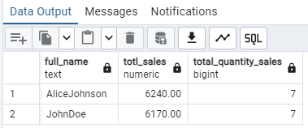
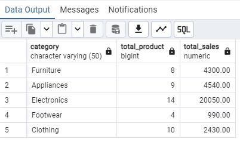
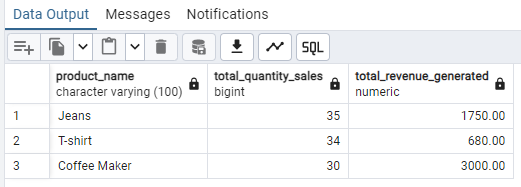

# SQL: Sales Management System
This database tracks information for a sales system. It has three tables: Employee, Product, and Sales. The Employee table lists staff names, job roles, salaries, and hire dates. The Product table includes items for sale, like their names, categories, prices, and stock levels. The Sales table records each sale, showing which employee sold what product, the sale date, quantity, and total amount. This setup helps analyze employee performance, product sales, and overall sales trends.
## Overview of the Tables:
### Employee Table:
This table stores information about the employees working in the sales department.

Columns:
* employee_id: Unique identifier for each employee (Primary Key).
* first_name: The first name of the employee.
* last_name: The last name of the employee.
* position: Job role or position held by the employee (e.g., Manager, Sales Associate).
* salary: Monthly salary of the employee.
* hire_date: The date when the employee was hired.

### Product Table:
This table maintains details of the products available for sale.

Columns:
* product_id: Unique identifier for each product (Primary Key).
* product_name: Name of the product.
* category: Category to which the product belongs (e.g., Electronics, Furniture).
* price: Selling price of the product.
* stock_quantity: The number of units available in stock.
  
### Sales Table:
This table records all the sales transactions.

Columns:
* sale_id: Unique identifier for each sale transaction (Primary Key).
* employee_id: The ID of the employee who made the sale (Foreign Key referencing Employee).
* product_id: The ID of the product sold (Foreign Key referencing Product).
* sale_date: The date when the sale occurred.
* quantity: The number of units sold in this transaction.
* total_amount: Total amount for the sale (calculated as price * quantity).
  
## Questions:
### Question 1:
Write a query to display the full name (combined first and last name) of each employee along with the total sales amount they have generated. Only include employees whose total sales exceed $5,000.
#### Query
```sql
SELECT 
    CONCAT(e.first_name, '', e.last_name) as full_name,
    SUM(s.total_amount) AS totl_sales,
    COUNT(s.sale_id) AS total_quantity_sales
FROM employee e
INNER JOIN sales s ON e.employee_id = s.employee_id
GROUP BY e.first_name, e.last_name
HAVING SUM(s.total_amount) > 5000;
```

#### Result


### Question 2:
List the product categories and the total quantity sold for each category. Display only those categories where the total quantity sold is more than 20 units.
#### Query
```sql
select p.category,
	   Count(p.product_id) as total_product,
       sum(s.total_amount) as total_sales
from product p
inner join sales s on p.product_id = s.product_id
group by p.category;
```

#### Result


### Question 3:
Find the top 3 employees who have made the highest total sales. Display their full names, total sales amounts, and their positions.
#### Query
```sql
select p.product_name,
       sum(s.quantity) as total_quantity_sales,
	   sum(s.total_amount) as total_revenue_generated
from product p
inner join sales s on p.product_id = s.product_id
group by p.product_id
order by total_quantity_sales DESC
LIMIT 3;
```

#### Result

